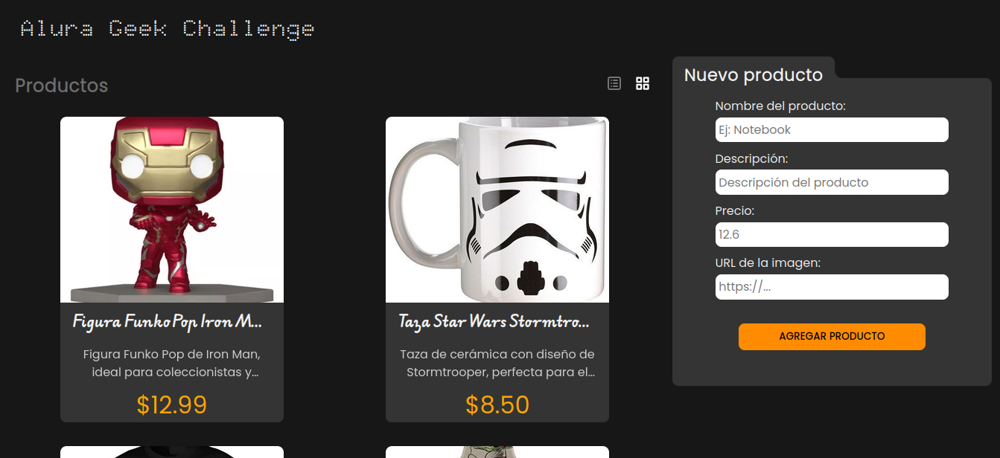

# Alura Geek Chanllenge 



Proyecto creado con el fin de validar el conocimiento adquirido en [Alura Latam](https://www.aluracursos.com/) de JavaScript en los siguientes puntos:
- Desarrollo de aplicaciones web responsivas
- Consumo de APIs
- Manipulación del DOM
- Validación de formularios
- Manipulación de arreglos
- Manipulación de Objetos
- Creación de componentes reutilizables
- Uso de Callbacks y Promises
- Creación de observables

## Tecnologías Utilizadas
- [HTML](https://developer.mozilla.org/en-US/docs/Web/HTML)
- [CSS](https://developer.mozilla.org/en-US/docs/Web/CSS)
- [JavaScript](https://developer.mozilla.org/en-US/docs/Web/JavaScript)

## Funcionalidades
- Muestran un listado de productos desde una API([MockAPI](https://mockapi.io))
- Multiples tipos de vista del listado de productos
- Permite agregar un nuevo producto
- Permite eliminar un producto

## Estructura del proyecto
```
├── api
│   └── api-endpoints.js
├── assets
│   ├── icons
│   │   ├── alura_icon.png
│   │   ├── heart-svgrepo-com.svg
│   │   ├── square-list-svgrepo-com.svg
│   │   └── squares-four-bold-svgrepo-com.svg
│   └── screenshot.png
├── data
│   └── default-data.js
├── helpers
│   └── config.js
├── scripts
│   ├── draw.js
│   └── main.js
├── eslint.config.mjs
├── index.html
├── README.md
└── style.css
```

## Comentarios
Al eliminar todos los productos se reinicia el listado cargando nuevamente una lista de productos por defecto.
